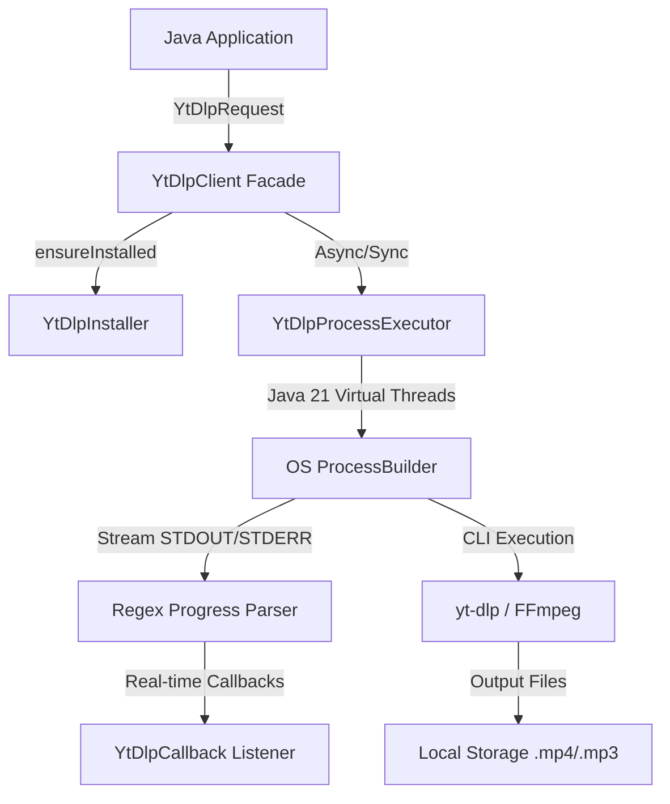

<div align="center">

  <h1>⚡ ytdlp-java</h1>
  <p><b>A next-generation, high-performance Java 21 wrapper for <code>yt-dlp</code> & <code>FFmpeg</code>.</b></p>
  <p><i>Uma biblioteca Java 21 de alta performance e assíncrona para <code>yt-dlp</code> e <code>FFmpeg</code>.</i></p>

  <p>
    <a href="#-english"></a>
    <a href="#-português"></a>
  </p>

  <p>
    
    
    <a href="https://jitpack.io/#LucasOliveira09/ytdlp-java"></a>
    
    
  </p>

  ---
</div>

## 📌 Navigation / Navegação

- [🇺🇸 English Documentation](#-english)
  - [Features](#-features)
  - [Architecture](#-architecture-overview)
  - [Installation](#-installation)
  - [Quick Start](#-quick-start)
- [🇧🇷 Documentação em Português](#-português)
  - [Funcionalidades](#-funcionalidades)
  - [Como Instalar no seu Projeto](#-como-instalar-no-seu-projeto)
  - [Exemplos Práticos](#-exemplos-práticos)
- [🛣️ Roadmap & Contributing](#%EF%B8%8F-roadmap--contributing)

---

# 🇺🇸 English

### 🌟 Why `ytdlp-java`?

`ytdlp-java` bridges the gap between Java applications and the world's most powerful media downloader tool, `yt-dlp`. Built from scratch leveraging **Java 21 Virtual Threads**, it allows you to download, convert, and inspect videos or audio from over 1,000+ platforms effortlessly.

```
+-------------------------------------------------------------------------+
| [download]  68.4% of ~ 15.42MiB at 4.20MiB/s ETA 00:03                   |
| ▓▓▓▓▓▓▓▓▓▓▓▓▓▓▓▓▓▓▓▓▓▓▓▓▓▓▓▓░░░░░░░░░░░░░░░                              |
+-------------------------------------------------------------------------+
```

### ✨ Features

| Feature | Description |
| :--- | :--- |
| ⚡ **Virtual Threads (Loom)** | Non-blocking process stream ingestion using Java 21 `Executors.newVirtualThreadPerTaskExecutor()`. |
| 🚀 **Zero-Setup Installer** | `client.ensureInstalled()` automatically downloads official `yt-dlp` executable matching host OS. |
| 🎯 **Fluent Builder API** | Clean, immutable `YtDlpRequest` builder for full control over CLI parameters & cookies. |
| 🔄 **Real-Time Progress** | Reactive callback listener delivering percentage, download speed, and ETA updates. |
| 🎵 **Audio Extraction** | Native FFmpeg audio processing (`MP3`, `AAC`, `FLAC`, `WAV`, custom quality presets). |
| 🔍 **Fast Metadata Reader** | Fetch video info without downloading media using `extractMetadataJson(url)`. |
| 🛡️ **Robust Error Handling** | Typed custom exceptions (`YtDlpNotFoundException`, `YtDlpExecutionException`). |

---

### 📐 Architecture Overview



---

### 📦 Installation

#### Gradle (Kotlin DSL)
```kotlin
repositories {
    mavenCentral()
    maven { url = uri("https://jitpack.io") }
}

dependencies {
    implementation("com.github.LucasOliveira09:ytdlp-java:1.1.0")
}
```

#### Gradle (Groovy DSL)
```groovy
repositories {
    mavenCentral()
    maven { url 'https://jitpack.io' }
}

dependencies {
    implementation 'com.github.LucasOliveira09:ytdlp-java:1.1.0'
}
```

#### Maven (`pom.xml`)
```xml
<repositories>
    <repository>
        <id>jitpack.io</id>
        <url>https://jitpack.io</url>
    </repository>
</repositories>

<dependency>
    <groupId>com.github.LucasOliveira09</groupId>
    <artifactId>ytdlp-java</artifactId>
    <version>1.1.0</version>
</dependency>
```

---

### 💻 Quick Start

#### 1️⃣ Basic Download with Zero-Setup Auto Installer
```java
// Automatically downloads yt-dlp binary if not installed on OS
YtDlpClient client = YtDlpClient.defaultClient().ensureInstalled();

YtDlpRequest request = YtDlpRequest.builder()
        .url("https://www.youtube.com/watch?v=dQw4w9WgXcQ")
        .outputDir(Path.of("./downloads"))
        .build();

YtDlpResponse response = client.execute(request);
System.out.println("Status: " + response.exitCode() + " | Time: " + response.elapsedTimeMs() + "ms");
```

#### 2️⃣ Asynchronous with Live Progress Updates
```java
YtDlpClient client = YtDlpClient.defaultClient().ensureInstalled();

YtDlpRequest request = YtDlpRequest.builder()
        .url("https://www.youtube.com/watch?v=dQw4w9WgXcQ")
        .outputDir(Path.of("./downloads"))
        .noPlaylist(true)
        .build();

client.executeAsync(request, (percent, speed, eta, status) -> {
    System.out.printf("Downloading: %.1f%% | Speed: %s | ETA: %s%n", percent, speed, eta);
}).thenAccept(response -> {
    System.out.println("Downloaded files: " + response.downloadedFiles());
}).join();
```

---

# 🇧🇷 Português

### 🌟 Por que usar a `ytdlp-java`?

A `ytdlp-java` conecta o ecossistema Java à ferramenta de download de mídias mais poderosa do mundo, o `yt-dlp`. Construída do zero aproveitando **Virtual Threads do Java 21**, ela permite que você baixe, converta e inspecione áudios e vídeos de mais de 1.000 plataformas com facilidade.

### ✨ Funcionalidades

| Recursos | Descrição |
| :--- | :--- |
| ⚡ **Virtual Threads (Loom)** | Leitura não-bloqueante de processos usando `Executors.newVirtualThreadPerTaskExecutor()`. |
| 🚀 **Instalação Zero-Setup** | `client.ensureInstalled()` baixa o binário oficial do `yt-dlp` automaticamente. |
| 🎯 **Fluent Builder API** | Construtor imutável `YtDlpRequest` para controle de parâmetros, cookies e formatos. |
| 🔄 **Progresso em Tempo Real** | Callback reativo com porcentagem, velocidade de download e tempo estimado (ETA). |
| 🎵 **Extração de Áudio** | Processamento nativo via FFmpeg (`MP3`, `AAC`, `FLAC`, `WAV` e qualidades ajustáveis). |
| 🔍 **Leitor de Metadados** | Extraia títulos, autores e capas em JSON sem precisar baixar a mídia (`extractMetadataJson`). |
| 🛡️ **Exceções Tipadas** | Tratamento robusto de erros com `YtDlpNotFoundException` e `YtDlpExecutionException`. |

---

### 📦 Como Instalar no seu Projeto Java

Para adicionar a biblioteca ao seu projeto Java (Spring Boot, Quarkus, JavaFX, CLI ou Bot), adicione o repositório **JitPack** e a dependência de acordo com a ferramenta que você usa:

#### 🐘 Se você usa Gradle (Kotlin DSL - `build.gradle.kts`):
```kotlin
repositories {
    mavenCentral()
    maven { url = uri("https://jitpack.io") }
}

dependencies {
    implementation("com.github.LucasOliveira09:ytdlp-java:1.1.0")
}
```

#### 🐘 Se você usa Gradle (Groovy DSL - `build.gradle`):
```groovy
repositories {
    mavenCentral()
    maven { url 'https://jitpack.io' }
}

dependencies {
    implementation 'com.github.LucasOliveira09:ytdlp-java:1.1.0'
}
```

#### 📦 Se você usa Maven (`pom.xml`):
```xml
<repositories>
    <repository>
        <id>jitpack.io</id>
        <url>https://jitpack.io</url>
    </repository>
</repositories>

<dependency>
    <groupId>com.github.LucasOliveira09</groupId>
    <artifactId>ytdlp-java</artifactId>
    <version>1.1.0</version>
</dependency>
```

---

### 💻 Exemplos Práticos

#### 1️⃣ Baixar Mídia em Áudio (MP3 em Alta Qualidade com Auto-Installer)
```java
// O ensureInstalled() baixa o yt-dlp automaticamente se o usuário não tiver!
YtDlpClient client = YtDlpClient.defaultClient().ensureInstalled();

YtDlpRequest request = YtDlpRequest.builder()
        .url("https://www.youtube.com/watch?v=dQw4w9WgXcQ")
        .outputDir(Path.of("./musicas"))
        .audioOnly(true)       // Baixa apenas o áudio
        .audioFormat("mp3")    // Converte para MP3
        .audioQuality("0")     // Qualidade máxima (0 a 9)
        .extractThumbnail(true) // Baixa também a capa
        .build();

YtDlpResponse response = client.execute(request);
```

#### 2️⃣ Suporte a Cookies (Para Vídeos Privados ou com Restrição de Idade)
```java
YtDlpClient client = YtDlpClient.builder()
        .defaultCookiesFromBrowser("chrome") // Lê os cookies do navegador Chrome
        .build();

YtDlpResponse response = client.execute(request);
```

---

## 🛣️ Roadmap & Contributing

- [x] Java 21 Virtual Threads process execution
- [x] Real-time progress parsing regex engine
- [x] Audio extraction & FFmpeg integration
- [x] JitPack publication configuration
- [x] Built-in automatic `yt-dlp` binary downloader (`ensureInstalled`)
- [ ] Spring Boot Starter module (`ytdlp-spring-boot-starter`)

Contributions are warmly welcomed! Please feel free to submit a Pull Request or open an Issue.

---

<div align="center">
  <p>Created with ❤️ by <a href="https://github.com/LucasOliveira09">Lucas Oliveira</a></p>
  <p>Distributed under the <b>MIT License</b>.</p>
</div>
